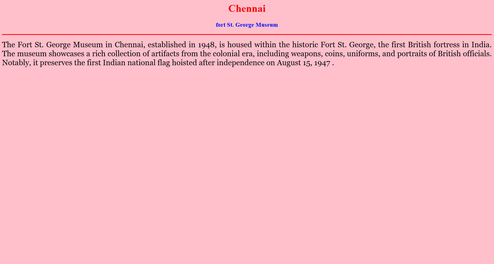
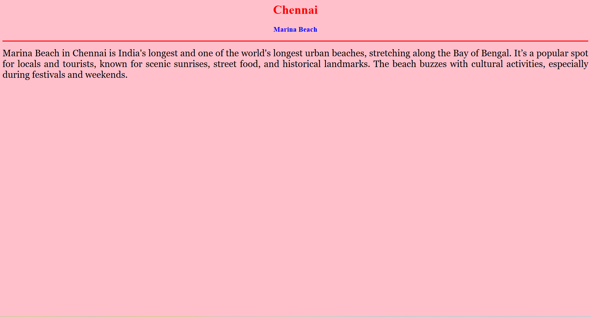
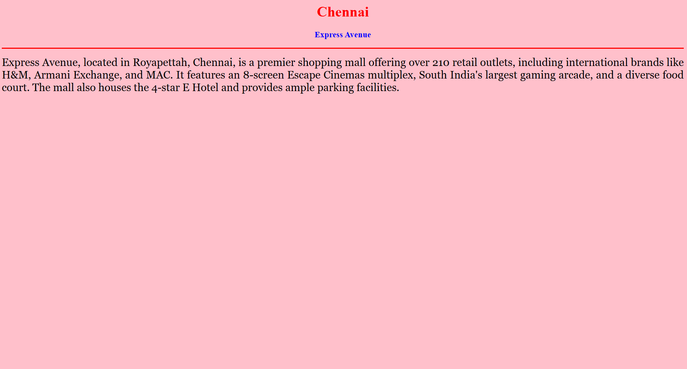
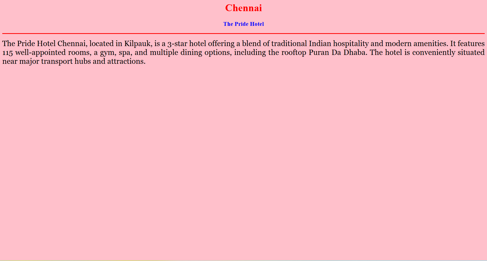

# Ex04 Places Around Me
# Date:19-04-2025
# AIM
To develop a website to display details about the places around my house.

# DESIGN STEPS
## STEP 1
Create a Django admin interface.

## STEP 2
Download your city map from Google.

## STEP 3
Using <map> tag name the map.

## STEP 4
Create clickable regions in the image using <area> tag.

## STEP 5
Write HTML programs for all the regions identified.

## STEP 6
Execute the programs and publish them.

# CODE

```

home.html

<html>
<head>
<title>My Home Town</title>
</head>
<body bgcolor="pink">
<h1 align="center">
<font color="red"><b>Chennai</b></font>
</h1>
<h3 align="center">
<font color="blue"><b>Chennai - my Home town</b></font>
</h3>
<hr size="3" color="red">
<p align="justify">
<font face="Georgia" size="5">
    Chennai, the capital of Tamil Nadu, is a vibrant coastal city known for its rich cultural heritage, classical music, and Dravidian-style temples. It blends tradition and modernity, with bustling markets, IT hubs, and Marina Beach. Chennai is a major economic, educational, and cultural center in South India.
</p>
</body>
</html>

```

```
museum.html

<html>
<head>
<title>My Home Town</title>
</head>
<body bgcolor="pink">
<h1 align="center">
<font color="red"><b>Chennai</b></font>
</h1>
<h3 align="center">
<font color="blue"><b>fort St. George Museum</b></font>
</h3>
<hr size="3" color="red">
<p align="justify">
<font face="Georgia" size="5">
    The Fort St. George Museum in Chennai, established in 1948, is housed within the historic Fort St. George, the first British fortress in India. The museum showcases a rich collection of artifacts from the colonial era, including weapons, coins, uniforms, and portraits of British officials. Notably, it preserves the first Indian national flag hoisted after independence on August 15, 1947 .    
</font>
</p>
</body>
</html>

```

```
beach.html

<html>
<head>
<title>My Home Town</title>
</head>
<body bgcolor="pink">
<h1 align="center">
<font color="red"><b>Chennai</b></font>
</h1>
<h3 align="center">
<font color="blue"><b>Marina Beach</b></font>
</h3>
<hr size="3" color="red">
<p align="justify">
<font face="Georgia" size="5">
    Marina Beach in Chennai is India's longest and one of the world's longest urban beaches, stretching along the Bay of Bengal. It’s a popular spot for locals and tourists, known for scenic sunrises, street food, and historical landmarks. The beach buzzes with cultural activities, especially during festivals and weekends.
</font>
</p>
</body>
</html>

```

```

mall.html

<html>
<head>
<title>My Home Town</title>
</head>
<body bgcolor="pink">
<h1 align="center">
<font color="red"><b>Chennai </b></font>
</h1>
<h3 align="center">
<font color="blue"><b>Express Avenue</b></font>
</h3>
<hr size="3" color="red">
<p align="justify">
<font face="Georgia" size="5">
    Express Avenue, located in Royapettah, Chennai, is a premier shopping mall offering over 210 retail outlets, including international brands like H&M, Armani Exchange, and MAC. It features an 8-screen Escape Cinemas multiplex, South India's largest gaming arcade, and a diverse food court. The mall also houses the 4-star E Hotel and provides ample parking facilities.
</font>
</p>
</body>
</html>

```

```

hotel.html

<html>
<head>
<title>My Home Town</title>
</head>
<body bgcolor="pink">
<h1 align="center">
<font color="red"><b>Chennai </b></font>
</h1>
<h3 align="center">
<font color="blue"><b>The Pride Hotel</b></font>
</h3>
<hr size="3" color="red">
<p align="justify">
<font face="Georgia" size="5">
    The Pride Hotel Chennai, located in Kilpauk, is a 3-star hotel offering a blend of traditional Indian hospitality and modern amenities. It features 115 well-appointed rooms, a gym, spa, and multiple dining options, including the rooftop Puran Da Dhaba. The hotel is conveniently situated near major transport hubs and attractions.
</font>
</p>
</body>

```
# OUTPUT










# RESULT
The program for implementing image maps using HTML is executed successfully.
